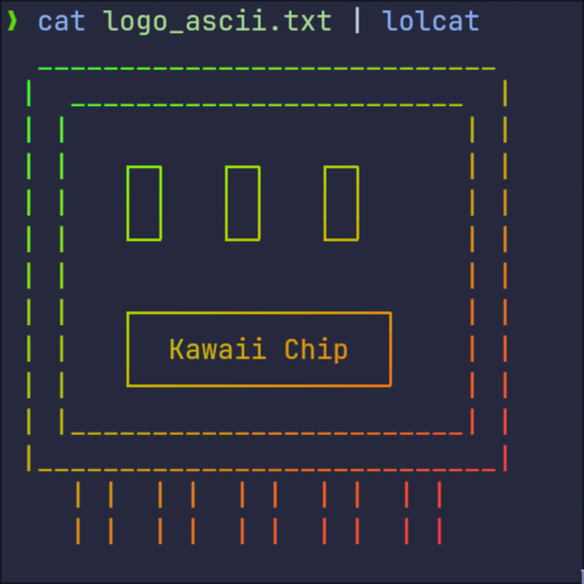

# Kawaii Chip Team Introduction

<!-- language switcher -->

  <a href="README.md">简体中文</a> | 
  English

<!-- logo -->

  

## Introduction

This organization focuses on providing support and services to the "Kawaii Chip" team participating in the [National College Student Embedded Chip and System Design Competition (SocChina)](http://www.socchina.net/), helping the team achieve excellent results in the competition.

Organization official website: https://kawaii-chip.github.io/

## Competition Tracks

- TBD

## Contributors

For privacy reasons, the list of contributors is not publicly available. Please refer to the README of each project repository for details.

## License

> The current main codebase is private, and arrangements for open sourcing and licensing will be announced later.  
> To learn about the licenses of the open-source components used in each project, please visit the corresponding repository's LICENSE file.

---

For more information and project details, please see the documentation and descriptions in each repository.
