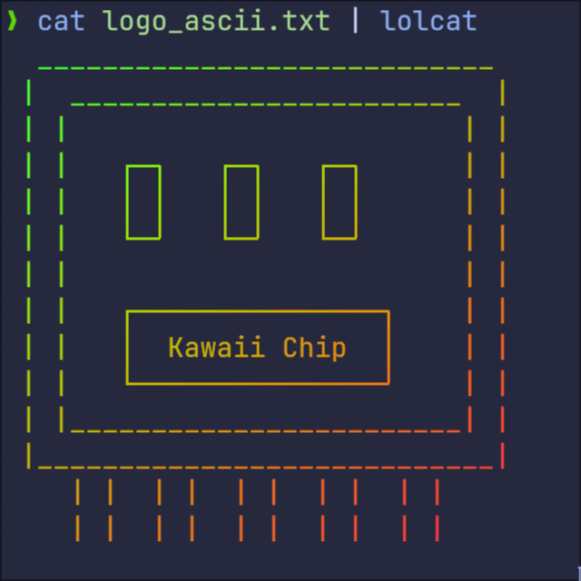

# Kawaii Chip 团队简介

<!-- language switcher -->

  简体中文 |
  <a href="README.en_US.md">English</a>

<!-- logo -->

  

## 介绍

本组织专注于为[全国大学生嵌入式芯片与系统设计竞赛（SocChina）](http://www.socchina.net/)参赛队伍“Kawaii Chip”提供支持与服务，助力队伍在赛道上取得优异成绩。

## 赛道

- 待补充

## 贡献者

出于隐私考虑，贡献者名单暂不公开。详情请参阅各项目仓库中的 README 文档。

## 许可证

> 当前核心代码仓库为私有，后续开源及许可证安排将另行公告。  
> 如需了解各项目中所使用的开源组件许可证，请访问对应仓库的 LICENSE 文件。

---

更多信息及项目详情，请查看各仓库中的文档与说明。
